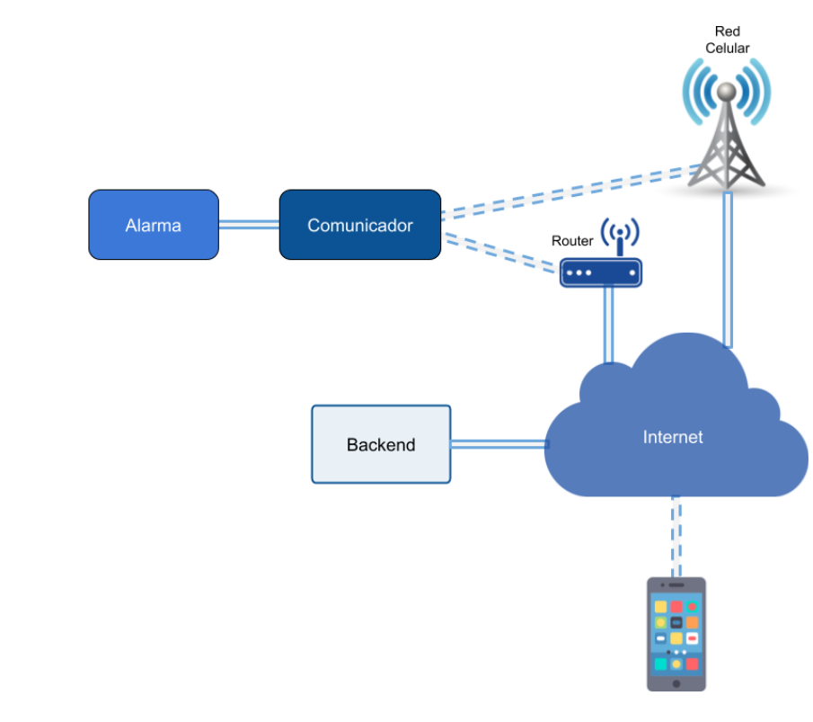

Ejercicio CiberKillChain - Ataque
=====================================
### Alumno

	 Olmedo Lucas Eduardo

### Enunciado

	Armar una cyberkillchain usando técnicas de la matriz de Att&ck para un escenario relacionado a tu trabajo práctico

### Datos trabajo práctico

Según lo acordado con el profesor, se utiliza el Trabajo final “Comunicador para centrales de alarma” de Mariano Mondani ya que todavía no tengo definido trabajo final para la especialidad. 

### Esquema general del sistema

El sistema que se desarrolló en ese trabajo consiste, por un lado, en un comunicador con conectividad Wi-Fi y celular compatible con las alarmas de la marca X-28. Por el otro, una aplicación móvil que le permite al usuario del sistema de seguridad no solo recibir notificaciones por los eventos que ocurran en su alarma, sino también, enviar comandos a esta para modificar su estado. Además se implementó un backend que permite la vinculación entre los comunicadores y las apps.

Según lo investigado en la arquitectura del informe se utilizan las siguientes tecnologías:
Tecnologías de comunicación: 
	Redes wifi
	Redes LTE Cat-M1
	Protocolo MQTT
	Protocolo HTTP
Tecnología del backend:
	AWS
	API rest
	MongoDB
Tecnología del frontend:
	Aplicaciones híbridas
	Ionic Framework y Capacitor

El objetivo del informe es aplicar Cyber kill chain para lograr controlar y deshabilitar una o mas alarmas x28 por medio del comunicador wifi. 

Resolución
==========

###  1- Reconnaissance
 Se investiga comprando un dispositivo y leyendo los manuales. También se investiga información del funcionamiento en internet y se encuentra ciertos detalles del funcionamiento. 
- Se plantea un ataque intentando obtener información desde los clientes de las alarmas, el objetivo es información de contraseñas de la app para controlar la alarma. Es necesario detectar clientes objetivos, para ello se utilizan redes sociales, seguir redes sociales de la empresa y analizar sus seguidores ya que los mismos pueden ser empleados o usuarios. 
- Se plantea utilizar analizadores de protocolos de paquetes o intentar por algún acercamiento con los empleados de X28 para obtener las contraseñas de AWS que controlan el sistema. 

###  2- Weaponization 

- Interceptando las redes de los clientes para obtener credenciales con programas como Wireshark para analizar el trafico de datos e intentar obtener las contraseñas de la app para comandar la alarma.
- Se utilizan técnicas de phishing tanto para los clientes de las alarmas (para obtener acceso al control de su alarma) como para los empleados de X28 para poder obtener acceso a las cuentas de AWS que controlan el sistema de las alarmas. 
-Crear cuentas falsas en redes sociales para seguir a los posibles objetivos. 
-Generar correos y/o  mensajes para phishing.

###  3-Delivery 

- Contactar por redes sociales a clientes y empleados de x28 para obtener información y lograr obtener las contraseñas de aplicaciones del controlador o de AWS. 
- Enviar mensajes para atacar por phishing o smishing.
- Ejecutar analizadores de protocolos en casas con la alarma y en la empresa

###  4-Exploitation 

- Algunos clientes proveen las contraseñas de la aplicación que controla el comunicador de un cliente. El atacante puede instalarse la aplicación para supervisar y controlar el estado de esa alarma en particular. 
-Algun empleado provee la contraseña de la cuenta AWS, el atacante podrá analizar y estudiar el sistema para luego modificar el comportamiento, controlando las alarmas que desea. 
- Luego de tener acceso a AWS el atacante puede modificar los accesos, analizar  el sistema y generar o modificar funciones para controlar las alarmas, por ejemplo deshabilitar todas las alarmas activadas. En caso de lograr obtener base de datos con contraseñas de controladores, el atacante resguarda esos datos. 

###  5-Installation
- Al tener las contraseñas ya no es necesaria una instalacion

###  6- Command & Control
- En el caso de obtener las contraseñas de la app de un controlador en particular, el atacante debe realizar la instalación de la app en un celular y asociar un controlador con las contraseñas.
- El atacante puede enviar mensajes desde la aplicación instalada para activar y desactivar la alarma en momentos en que el usuario de la alarma no lo detecte.
- Para AWS, el cliente debería habilitar todo los accesos que pueda sin que la victima logre detectarlos y que en caso de detectarlos le quede alguna forma de acceder. 
- El atacante puede obtener todos los datos de usuarios y contraseña de las aplicaciones de los usuarios desde AWS. 

###  7- Actions on Objectives

- El atacante puede deshabilitar una alarma desde una aplicación, utilizando la contraseña del controlador. Luego de desactivarla pueden ingresar físicamente a robar. 
-El atacante puede deshabilitar por medio de AWS una o mas alarmas enviando falsos comandos para dejar desprotegidas las casas que no tengan ocupantes y poder ingresar a Robar. 

Si bien se plantes desactivar las alarmas con el objetivo de ingresar a una casa o local, el ataque también puede ser utilizado para pedir recompensa a la empresa en caso de tomar el control de todos los datos por ejemplo. 
